**项目概述**

EDA Buddy 是为嘉立创 EDA 开发的设计辅助插件，提供常用电气计算、原理图/PCB 一键放置与差分对管理等功能，旨在加速电路设计与参数校核。

**主要功能**

- PCB 线宽与过孔尺寸计算
- 在 PCB 界面读取并应用线宽与过孔
- 分压计算：根据电压计算分压电阻；根据电阻计算分压电压
- 一键在原理图放置元件（受 EDA bug 限制，部分功能暂未实现）
- 非隔离开关电源电感值计算，并提供商城搜索入口
- 原理图中一键放置常用元件：
    - Type-C 及 CC 下拉电阻
    - 彩色 LED 与限流电阻
    - I2C 上拉电阻
    - USB 接口（贴片插件 / 公头 / 母座 / USB2 / USB3）
- PCB 差分对快速创建与疑似差分对识别
- 界面适配浅色模式与深色模式，使用更加贴心

**使用说明**

- 对于在嘉立创EDA：
    - 直接点击安装即可
- 对于 Github:
    - 前往[Release](https://github.com/xiaowine/EDA-Buddy/releases)下载`eda-buddy_vx.x.x.eext`文件  
      之后前往嘉立创顶栏->高级->扩展管理器->右下角导入，选择下载的文件进行安装

#### 使用小提示:在嘉立创 EDA 扩展管理器中勾选`显示在顶部菜单栏`以便快速访问插件功能。

**功能快速预览（深色模式截图）**

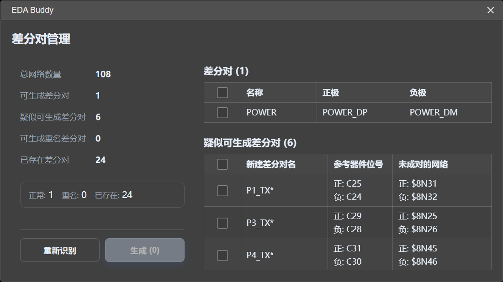
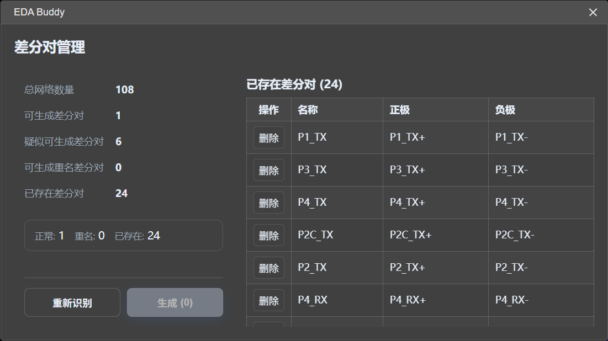
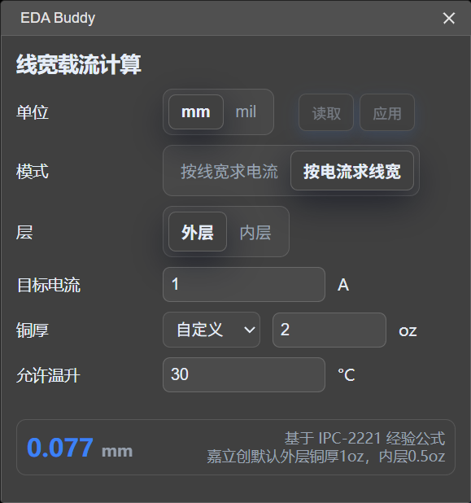

---

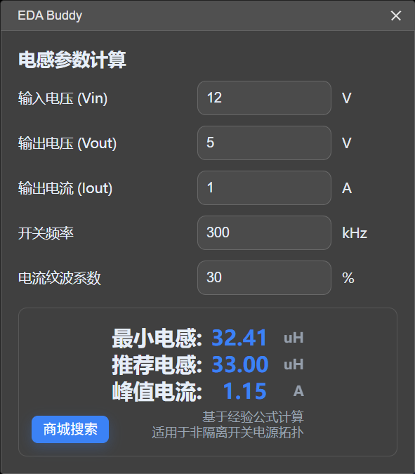
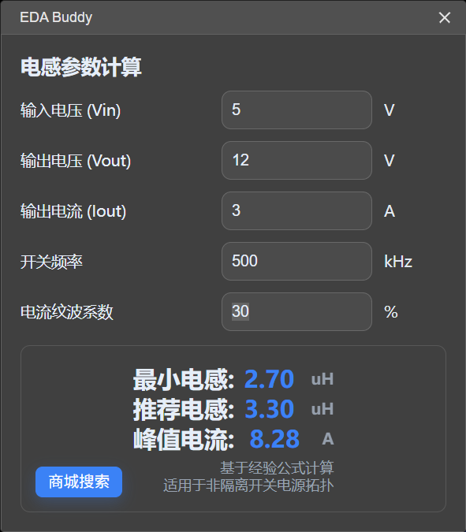

---

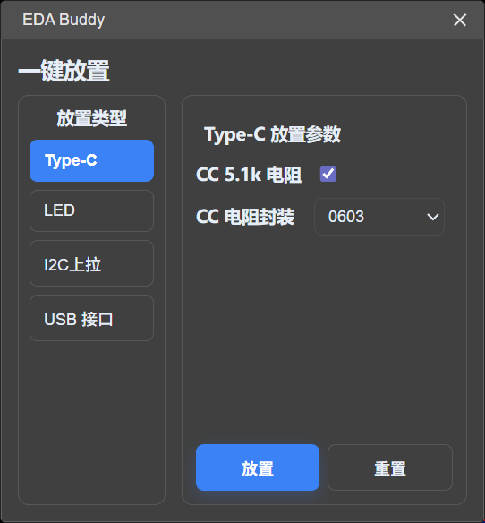
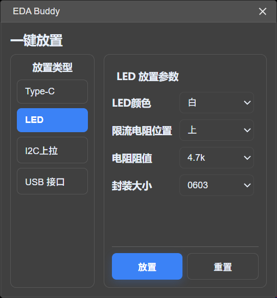
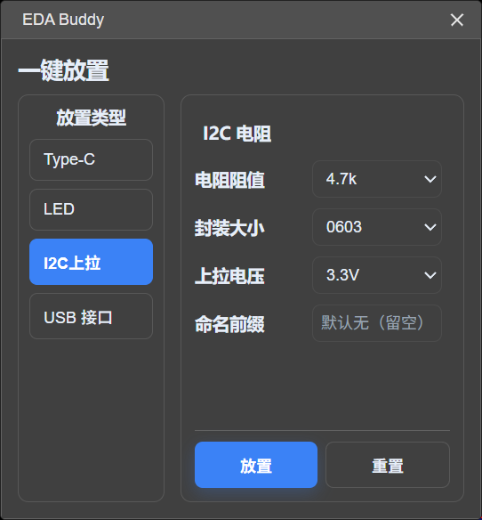
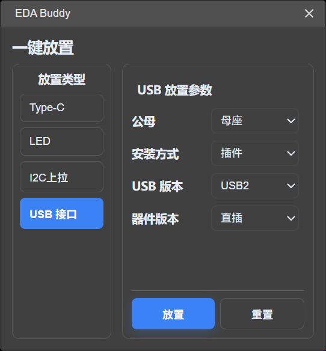

---

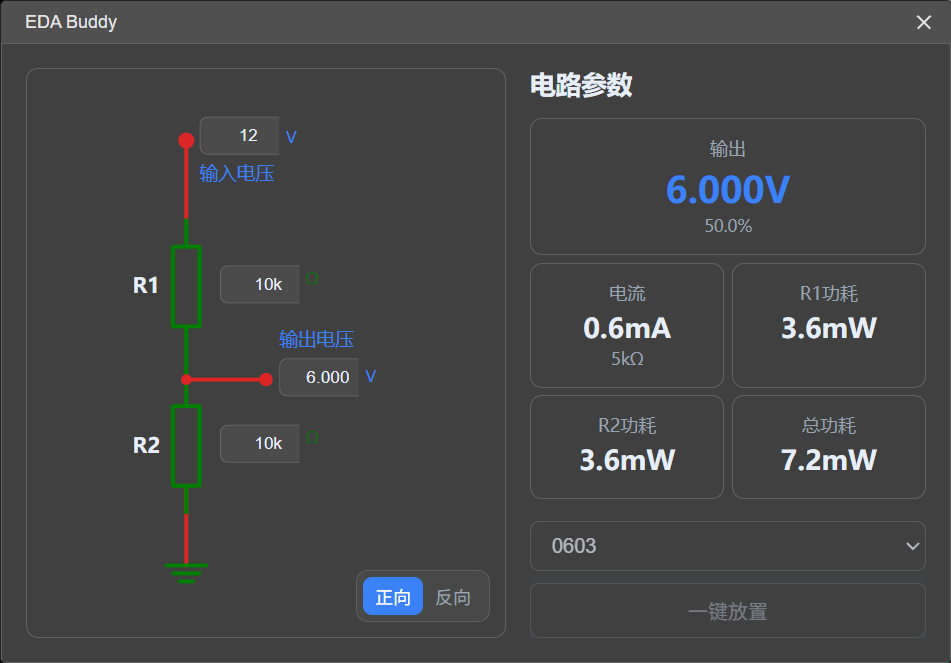
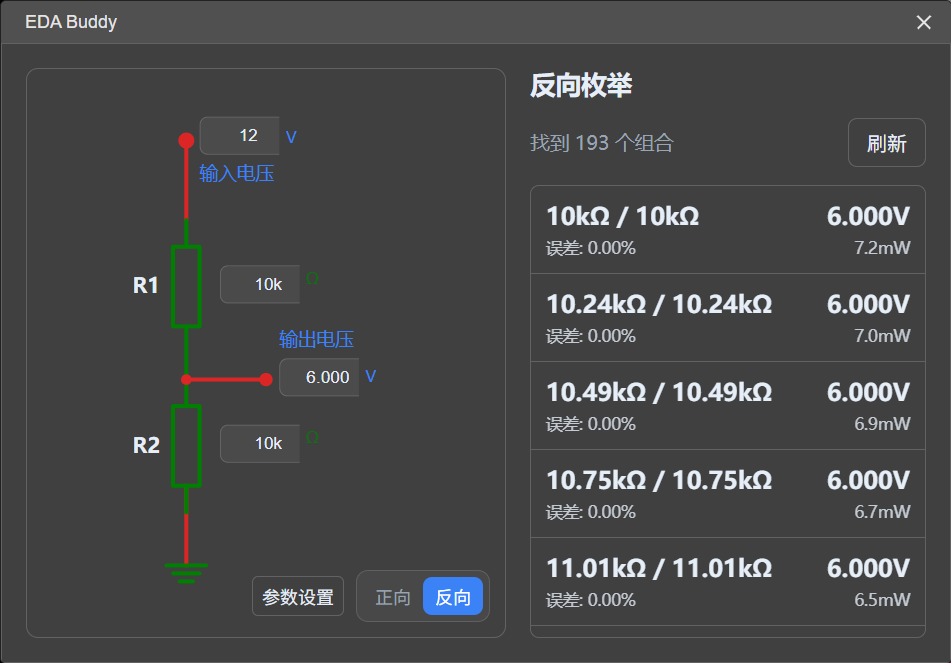
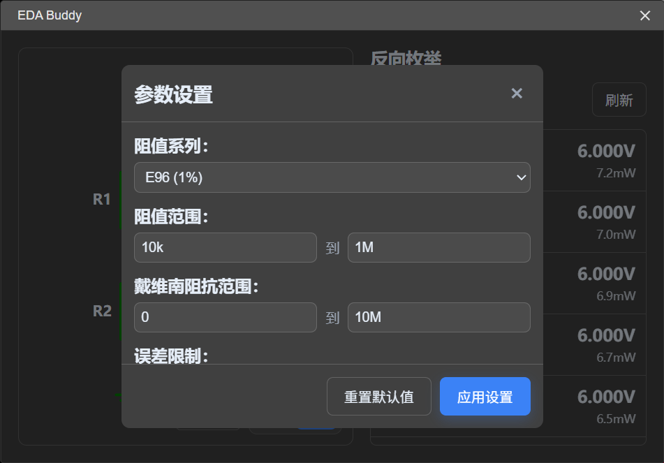

---

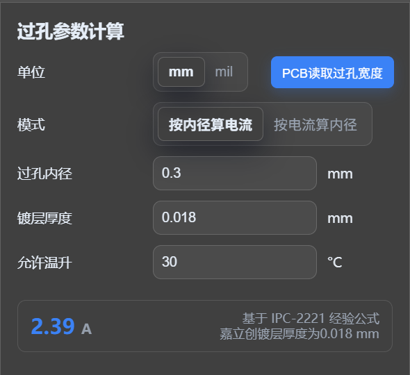

---

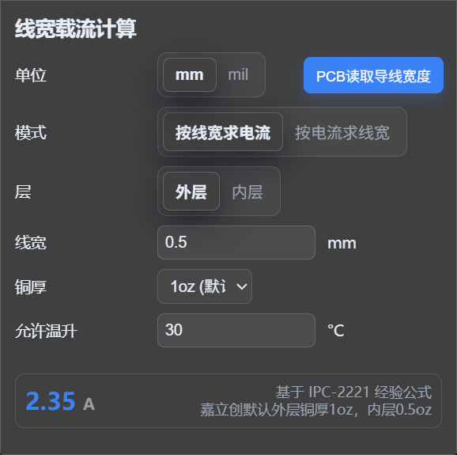

**贡献与反馈**

欢迎在[Github仓库](https://github.com/xiaowine/EDA-Buddy)提交 Issue/PR
提交前请运行现有 lint/格式化脚本并附上复现步骤。

或者前往[嘉立创扩展广场](https://ext.lceda.cn/item/xiao_wine/eda-buddy)反馈建议与问题。

**许可证**

本项目采用 GPL v3 许可证。
